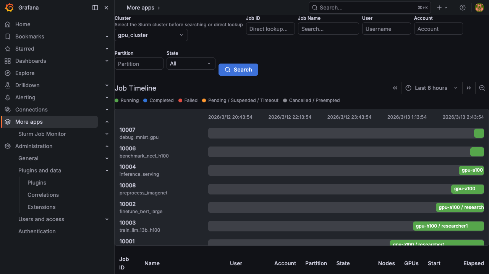

# Grafana Slurm Job Monitor

Grafana app plugin for monitoring Slurm jobs on GPU clusters. View per-job GPU, CPU, memory, and network metrics with automatic time range and node filtering.




## Documentation

See the **[User Guide](./docs/overview.md)** for full documentation:

- [Job Search](./docs/job-search.md) - Search and filter jobs with timeline and table views
- [Job Dashboard](./docs/job-dashboard.md) - Per-job GPU, CPU, memory, network, and disk metrics
- [Metric Explorer](./docs/metric-explorer.md) - Discover, pin, and auto-filter metrics
- [Dashboard Export](./docs/dashboard-export.md) - Export job dashboards as standalone Grafana dashboards
- [Configuration](./docs/configuration.md) - Set up connections, clusters, and access rules

## Features

- **Job Search**: Search and filter Slurm jobs by user, partition, state, and name with interactive timeline
- **Job Dashboard**: Dynamic per-job dashboards using Grafana Scenes API
  - Automatic time range (job start → end)
  - Automatic node filtering via PromQL
  - GPU metrics (DCGM exporter): utilization, memory, temperature, power, NVLink
  - CPU/Memory metrics (node_exporter): utilization, load, memory usage
  - Network metrics: NIC throughput, InfiniBand bandwidth
  - Disk I/O: read/write throughput, IOPS
- **Metric Explorer**: Discover and pin metrics from Prometheus/VictoriaMetrics
- **Auto Filter**: Automatic metric selection via MetricSifter change-point detection
- **Dashboard Export**: Export job views as standalone Grafana dashboards
- **Multi-Cluster**: Monitor multiple Slurm clusters from a single Grafana instance
- **Access Control**: Role-based and user-based access rules per cluster

## Architecture

```
┌─────────────┐     ┌──────────────────┐     ┌────────────┐
│  Grafana UI │────▶│  Go Backend      │────▶│  slurmdbd   │
│  (Scenes)   │     │  (CallResource)  │     │  MariaDB    │
└──────┬──────┘     └──────────────────┘     └────────────┘
       │
       │  PromQL queries
       ▼
┌──────────────┐
│  Prometheus  │◀── DCGM exporter (GPU metrics)
│  /Victoria   │◀── node_exporter (CPU/mem/net/disk)
└──────────────┘
```

## Requirements

- Grafana >= 12.4.0
- Prometheus or VictoriaMetrics with:
  - [NVIDIA DCGM exporter](https://github.com/NVIDIA/dcgm-exporter) (port 9400)
  - [node_exporter](https://github.com/prometheus/node_exporter) (port 9100)
- slurmdbd with MariaDB/MySQL

## Installation

### Using grafana-cli (recommended)

Install the plugin directly from the release URL using [`grafana-cli`](https://grafana.com/docs/grafana/latest/cli/):

```bash
grafana-cli --pluginUrl \
  https://github.com/yuuki/grafana-slurm-app/releases/download/v<version>/yuuki-slurm-app-<version>.zip \
  plugins install yuuki-slurm-app
```

### Manual installation

1. Download the latest `yuuki-slurm-app-<version>.zip` from the [Releases](https://github.com/yuuki/grafana-slurm-app/releases) page
2. Extract it into Grafana's plugin directory:

```bash
unzip yuuki-slurm-app-*.zip -d /var/lib/grafana/plugins/
```

> The default plugin directory is `/var/lib/grafana/plugins/` on Linux. The actual path depends on your Grafana configuration ([`[paths].plugins`](https://grafana.com/docs/grafana/latest/setup-grafana/configure-grafana/#plugins)).

### Post-install setup

1. Allow loading the unsigned plugin in `grafana.ini`:

```ini
[plugins]
allow_loading_unsigned_plugins = yuuki-slurm-app
```

Or set the equivalent environment variable:

```bash
GF_PLUGINS_ALLOW_LOADING_UNSIGNED_PLUGINS=yuuki-slurm-app
```

2. Restart Grafana:

```bash
sudo systemctl restart grafana-server
```

3. Configure data sources at **Administration → Plugins → Slurm Job Monitor → Configuration**

## Development

### Prerequisites

- Node.js 24 LTS
- Go >= 1.26.1
- Python >= 3.10
- Docker & Docker Compose

### Setup

```bash
npm install

# Generate metrics data, create Prometheus TSDB blocks, and start all services
./dev/setup.sh

# Or manually:
docker compose up -d   # Grafana + Prometheus + MariaDB (mock data)

# Terminal 1: Frontend (watch mode)
npm run dev

# Terminal 2: Backend
mage -v build:linux  # or build:darwin for macOS
```

Grafana listens on a dynamically assigned localhost port by default to avoid collisions with other projects:

```bash
docker compose port grafana 3000
```

Open the reported address in your browser and sign in with `admin/admin`.

### Install from source

Build and copy the plugin into Grafana's plugin directory with one command:

```bash
npm run install:grafana
```

The default destination is `/var/lib/grafana/plugins/yuuki-slurm-app`.
To install to a different directory, pass it as the first argument:

```bash
npm run install:grafana -- /path/to/grafana/plugins/yuuki-slurm-app
```

If you need to cross-build for a Linux Grafana host from another machine, set `TARGET_OS` and `TARGET_ARCH`:

```bash
TARGET_OS=linux TARGET_ARCH=amd64 npm run install:grafana
```

After installation, allow the unsigned plugin and restart Grafana (see [Installation](#installation)).

### Deploy to a remote Grafana over SSH

Build locally and upload the plugin to a remote Grafana host with:

```bash
DEPLOY_HOST=grafana.example.com npm run deploy:grafana:ssh
```

Common options:

```bash
DEPLOY_HOST=grafana.example.com \
DEPLOY_USER=deploy \
DEPLOY_PORT=22 \
REMOTE_PLUGIN_DIR=/var/lib/grafana/plugins/yuuki-slurm-app \
REMOTE_SUDO=1 \
RESTART_GRAFANA=1 \
TARGET_OS=linux \
TARGET_ARCH=amd64 \
npm run deploy:grafana:ssh
```

Environment variables:

1. `DEPLOY_HOST`: required remote host name or IP
2. `DEPLOY_USER`: optional SSH user
3. `DEPLOY_PORT`: optional SSH port, default `22`
4. `REMOTE_PLUGIN_DIR`: remote plugin directory, default `/var/lib/grafana/plugins/yuuki-slurm-app`
5. `REMOTE_SUDO`: set to `1` if the remote directory or restart operation requires `sudo`
6. `RESTART_GRAFANA`: set to `1` to restart Grafana after upload
7. `GRAFANA_SERVICE`: systemd service name, default `grafana-server`
8. `TARGET_OS` / `TARGET_ARCH`: target platform for the backend binary, defaults `linux/amd64`

This script expects passwordless SSH access or an agent-managed key on the machine running the command.

### Full remote deployment over SSH

If you want to deploy both the plugin and the MetricSifter sidecar to the same remote host, use:

```bash
DEPLOY_HOST=grafana.example.com npm run deploy:full:ssh
```

Common options:

```bash
DEPLOY_HOST=grafana.example.com \
DEPLOY_USER=deploy \
DEPLOY_PORT=22 \
REMOTE_PLUGIN_DIR=/var/lib/grafana/plugins/yuuki-slurm-app \
REMOTE_METRICSIFTER_DIR=/opt/yuuki-slurm-app/metricsifter \
REMOTE_SUDO=1 \
RESTART_GRAFANA=1 \
TARGET_OS=linux \
TARGET_ARCH=amd64 \
METRICSIFTER_PORT=18000 \
METRICSIFTER_GRAFANA_URL=http://127.0.0.1:18000 \
npm run deploy:full:ssh
```

This script:

1. Builds the Grafana plugin locally and uploads it to the remote plugin directory
2. Uploads `dev/metricsifter_service` to the remote host
3. Builds a Docker image for the MetricSifter sidecar on the remote host
4. Recreates the sidecar container

Additional environment variables:

1. `REMOTE_METRICSIFTER_DIR`: remote directory for the sidecar source, default `/opt/yuuki-slurm-app/metricsifter`
2. `METRICSIFTER_IMAGE_NAME`: remote Docker image name, default `yuuki-slurm-app-metricsifter`
3. `METRICSIFTER_CONTAINER_NAME`: remote Docker container name, default `yuuki-slurm-app-metricsifter`
4. `METRICSIFTER_BIND_HOST`: remote bind host for the sidecar, default `127.0.0.1`
5. `METRICSIFTER_PORT`: remote published port for the sidecar, default `18000`
6. `METRICSIFTER_RESTART_POLICY`: Docker restart policy, default `unless-stopped`
7. `METRICSIFTER_GRAFANA_URL`: URL that Grafana should use to reach the sidecar, default `http://127.0.0.1:<METRICSIFTER_PORT>`

Assumptions:

- Grafana runs directly on the remote host, not inside another container
- Docker is installed on the remote host
- The Grafana process can reach `METRICSIFTER_GRAFANA_URL`

### Services

| Service | URL | Description |
|---------|-----|-------------|
| Grafana | http://localhost:3000 | admin/admin |
| Prometheus | http://localhost:9090 | Metrics storage |
| MariaDB | localhost:3306 | slurm/slurm |
| Mock Exporter | http://localhost:9999/metrics | RUNNING job metrics |

### Data

- **100 Slurm jobs** in MariaDB with realistic metadata
- **Historical metrics** backfilled into Prometheus (past 7 days)
- **Live metrics** for RUNNING jobs via mock exporter

### Regenerating Data

```bash
python3 dev/generate-metrics.py
./dev/setup.sh
```

### Testing

```bash
# Go tests
go test ./pkg/... -v

# Frontend tests
npm test

# Type check
npm run typecheck
```

## Configuration

1. Navigate to **Administration → Plugins → Slurm Job Monitor → Configuration**
2. Add a database connection for your slurmdbd MariaDB/MySQL
3. Add a cluster profile with Slurm cluster name and Prometheus datasource UID
4. Optionally configure access rules and MetricSifter settings

See the [Configuration Guide](./docs/configuration.md) for details.

## License

Apache License 2.0
