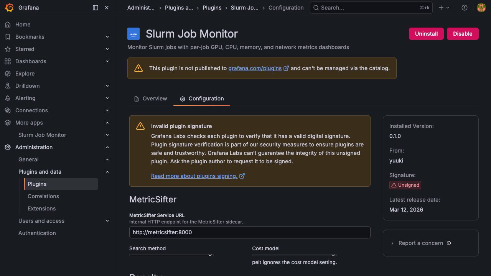

# Configuration

Configure the Slurm Job Monitor plugin by navigating to **Administration > Plugins > Slurm Job Monitor > Configuration**.

## Connection Profiles

Connection profiles define how the plugin connects to slurmdbd's MariaDB/MySQL database. You can configure multiple connections to support different database servers.

Click **Add Connection** to create a new profile.

| Field | Description | Example |
|-------|-------------|---------|
| Connection ID | Unique identifier for this connection | `default` |
| Database Host | MySQL host and port | `mysql:3306` |
| Database Name | slurmdbd database name | `slurm_acct_db` |
| Database User | MySQL user | `slurm` |
| Password | MySQL password (stored securely) | - |

## Cluster Profiles

Cluster profiles map Slurm clusters to their database connections and metrics datasources. Each cluster appears as a selectable option in the Job Search page.

Click **Add Cluster** to create a new profile.

### Basic Settings

| Field | Description | Example |
|-------|-------------|---------|
| Cluster ID | Unique identifier (used in URLs) | `gpu_cluster` |
| Display Name | Human-readable name shown in UI | `GPU Cluster` |
| Connection | Database connection to use | `default` |
| Slurm Cluster Name | Cluster name as registered in slurmdbd | `gpu_cluster` |

### Metrics Settings

| Field | Description | Default |
|-------|-------------|---------|
| Metrics Datasource UID | UID of your Prometheus or VictoriaMetrics datasource | - |
| Metrics Type | `prometheus` or `victoriametrics` | `prometheus` |
| Instance Label | Prometheus label identifying node instances | `instance` |
| Aggregation Node Labels | Comma-separated labels for metric aggregation | `host.name` |
| Node Matcher Mode | How to match nodes: `host:port` or `hostname` | `host:port` |
| Metrics Filter Label | Optional label to further filter metrics | - |
| Metrics Filter Value | Value for the filter label | - |

`host:port` mode matches any numeric port suffix on the instance label. Use `hostname` when your datasource stores hostnames without a port.

### Template Settings

| Field | Description | Default |
|-------|-------------|---------|
| Default Template ID | Dashboard template to use when auto-detection does not match | `overview` |

Available templates: `overview`, `distributed-training`, `inference`. See [Job Dashboard - Templates](./job-dashboard.md#dashboard-templates) for auto-selection criteria.

## Access Rules

Each cluster profile can define access rules to control who can view its jobs.

| Field | Description |
|-------|-------------|
| Allowed Roles | Grafana roles that can access this cluster (Viewer, Editor, Admin) |
| Allowed Users | Specific usernames that can access this cluster |

If both fields are empty, all users can access the cluster.

## Dashboard Export

| Field | Description | Default |
|-------|-------------|---------|
| Default Export Folder | Default Grafana folder for exported dashboards. Users can override this when exporting. | `General` |

## MetricSifter Settings

If you use the [MetricSifter](https://github.com/yuuki/metricsifter) sidecar for automatic metric filtering, configure it here:

| Field | Description | Default |
|-------|-------------|---------|
| MetricSifter Service URL | HTTP endpoint of the MetricSifter service | `http://metricsifter:8000` |
| Filter Granularity | Controls whether MetricSifter filters at per-series or per-metric level (see below) | `Disaggregated` |
| Search Method | Default change-point detection algorithm | `pelt` |
| Cost Model | Default cost function | `rbf` |
| Penalty | Default penalty type | `bic` |
| Penalty Adjust | Penalty adjustment coefficient | `1.0` |
| Bandwidth | Kernel bandwidth | - |
| Segment Selection Method | Segment selection strategy | `weighted_max` |
| nJobs | Parallelism for analysis | `1` |

### Filter Granularity

This setting controls how MetricSifter processes time series for auto-filtering. See [Metric Explorer - Auto Filter](./metric-explorer.md#filter-granularity) for the user-facing behavior.

| Mode | Behavior |
|------|----------|
| **Disaggregated** (default) | Each individual time series (e.g., GPU 0, GPU 1, disk `sda`, disk `nvme0n1`) is sent to MetricSifter separately. Only the specific series with significant changes appear in panels. |
| **Aggregated** | All series for the same metric are averaged into a single representative value before analysis. Either all series for a metric are shown, or the entire metric is hidden. |

## Legacy Single-Cluster Migration

If you previously configured the plugin with the older single-cluster format, your settings are automatically migrated to the new multi-cluster format on plugin load. No manual action is required.
