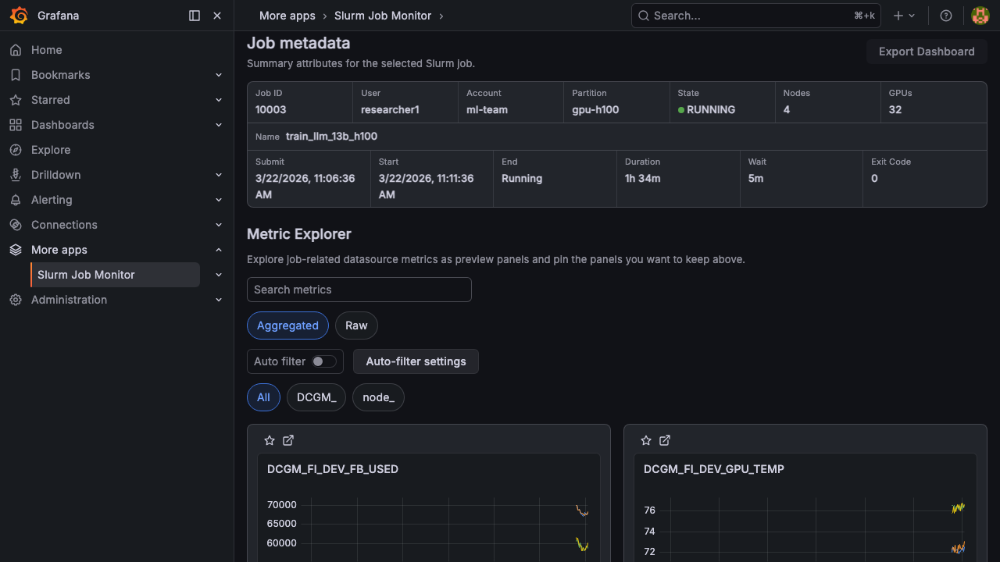
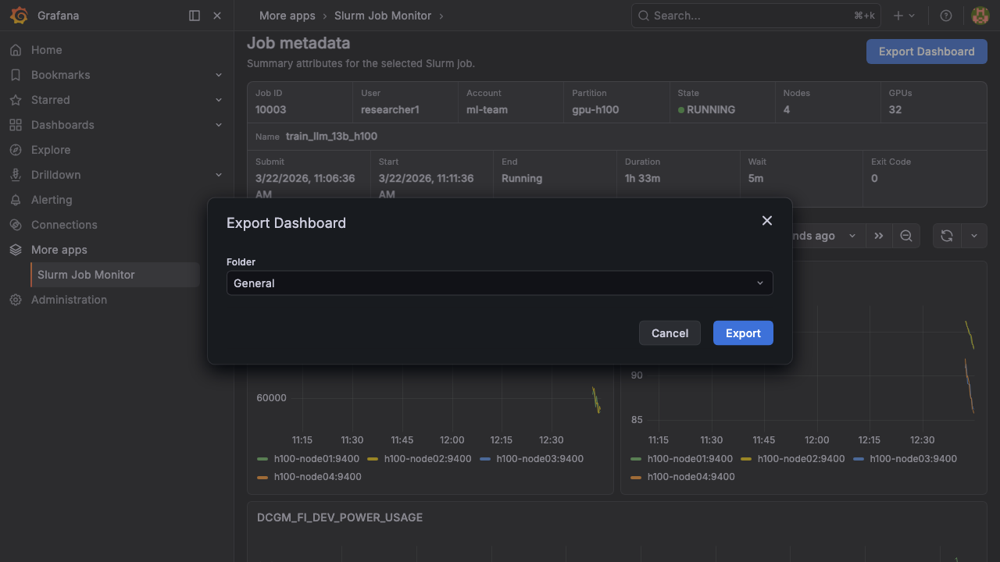

# Dashboard Export

Export a job's metrics view as a standalone Grafana dashboard. This creates a permanent dashboard that can be shared, bookmarked, and accessed without the plugin.

## How to Export

1. Open the [Job Dashboard](./job-dashboard.md) for any job
2. [Pin](./metric-explorer.md#pinning-metrics) the metrics you want to include — the **Export Dashboard** button is disabled until at least one metric is pinned
3. Click **Export Dashboard** to open the export dialog
4. Select a destination **Folder** (defaults to the folder configured in [plugin settings](./configuration.md#dashboard-export))
5. Click **Export** — the plugin creates a new Grafana dashboard via the Grafana API

**Required role**: Editor or Admin. Viewers cannot export dashboards.

## Exported Dashboard Contents

The exported dashboard contains one timeseries panel per pinned metric, arranged in a 2-column grid. Each panel uses the same PromQL query and display mode (Aggregated / Raw) shown in the Metric Explorer at the time of export.

## Dashboard Properties

| Property | Value |
|----------|-------|
| Title | `Slurm Job {clusterId}/{jobId} {jobName}` |
| Tags | `slurm`, `job`, `{clusterId}`, `{templateId}` |
| Time Range | Job start time to job end time (or `now` for running jobs) |

Each panel contains the same PromQL queries used in the plugin's Job Dashboard, pre-filtered to the job's allocated nodes. The exported dashboard is fully self-contained and does not depend on the plugin to render.

## Linking External Dashboards

You can also create custom dashboards that integrate with the plugin's Job Search page:

1. Create a Grafana dashboard with template variables for Slurm job attributes
2. Add the tag `slurm-job-link` to the dashboard
3. When users click a job in the Job Search, a picker will offer your custom dashboard as a destination

The following template variables are passed automatically:

| Variable | Description |
|----------|-------------|
| `slurm_cluster_id` | Cluster identifier |
| `slurm_job_id` | Slurm job ID |
| `slurm_job_name` | Job name |
| `slurm_user` | Submitting user |
| `slurm_account` | Slurm account |
| `slurm_partition` | Partition |
| `slurm_state` | Job state |
| `slurm_node_count` | Number of nodes |
| `slurm_gpu_count` | Total GPUs |
| `slurm_node` | Multi-value: one entry per allocated node |

The time range (`from`/`to`) is set to the job's execution window.
