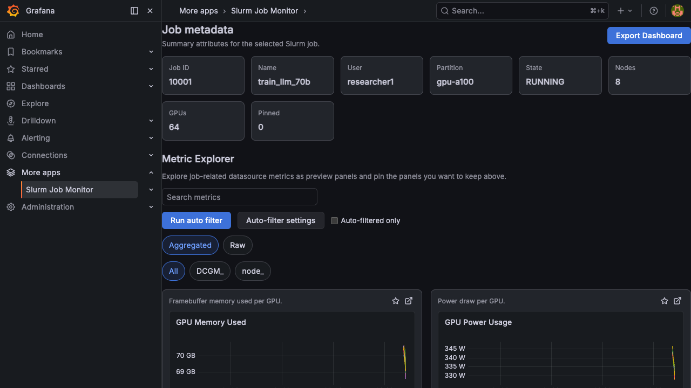

# Job Dashboard

The Job Dashboard provides a detailed, per-job view of all relevant metrics. It automatically sets the time range to the job's execution window and filters metrics to only the allocated nodes.

## Job Metadata

A summary card grid at the top shows key job attributes:

- **Job ID** - Slurm job identifier
- **Name** - Job name
- **User** - Submitting user
- **Partition** - Slurm partition
- **State** - Current state (Running, Completed, Failed, etc.)
- **Nodes** - Number of allocated nodes
- **GPUs** - Total GPU count
- **Pinned** - Number of user-pinned metrics

## Metric Panels

Below the metadata, metric panels display time-series graphs for the job's allocated nodes. Panels are organized into categories:

### GPU Metrics (DCGM Exporter)

| Panel | Description |
|-------|-------------|
| GPU Utilization | GPU core utilization percentage per node |
| GPU Memory Used | Framebuffer memory usage per GPU |
| GPU Temperature | Temperature with threshold coloring (75C orange, 85C red) |
| GPU Power Usage | Power draw in watts per GPU |
| SM Clock | Streaming multiprocessor clock frequency |
| NVLink Bandwidth | Inter-GPU communication throughput |

### CPU & Memory Metrics (node_exporter)

| Panel | Description |
|-------|-------------|
| CPU Utilization | CPU usage percentage derived from `node_cpu_seconds_total` |
| Memory Usage | Total memory consumption in bytes |

### Network Metrics

| Panel | Description |
|-------|-------------|
| Network Receive | Incoming network throughput (bytes/sec) |
| Network Transmit | Outgoing network throughput (bytes/sec) |

### Disk Metrics

| Panel | Description |
|-------|-------------|
| Disk Read | Read throughput (bytes/sec) |
| Disk Write | Write throughput (bytes/sec) |

## Display Modes

Toggle between two display modes using the buttons above the panels:

- **Aggregated** - Metrics averaged across nodes by a configured label (e.g., `host.name`). Best for a high-level overview.
- **Raw** - Individual time series per GPU/node. Best for identifying per-device anomalies.

## Metric Filtering

Use the filter tabs to focus on specific metric sources:

- **All** - Show all metric panels
- **DCGM_** - Show only GPU metrics from DCGM exporter
- **node_** - Show only system metrics from node_exporter

## Dashboard Templates

The plugin automatically selects a dashboard template based on the job's characteristics:

| Template | Auto-selection Criteria |
|----------|------------------------|
| **Distributed Training** | GPU count >= 8, or GPU partition with name containing `train`, `pretrain`, `finetune`, `sft`, `rlhf` |
| **Inference** | Job name containing `infer`, `serve`, `benchmark`, `eval` |
| **Overview** | Default fallback for all other jobs |

You can override the template by appending `?template=<id>` to the URL.

## Explore in Grafana

Each panel includes an "Explore" icon button that opens the underlying PromQL query in Grafana Explore for deeper investigation.
