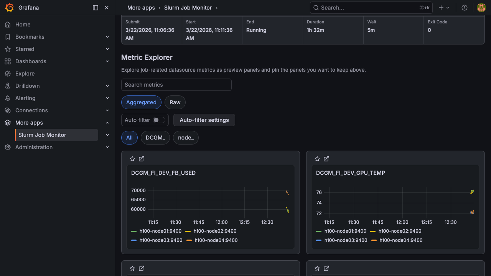

# Metric Explorer

The Metric Explorer lets you discover, browse, and pin metrics from your monitoring stack. It automatically finds all metrics available for the job's allocated nodes and time range.

## Discovering Metrics

The Metric Explorer queries your Prometheus or VictoriaMetrics datasource to find all metric series matching the job's node list. Metrics are presented as preview panels that you can browse and evaluate.

Use the **Search metrics** text field to filter the metric list by name.

## Pinning Metrics

Click the star icon on any panel to **pin** it. Pinned metrics are promoted to the top of the dashboard and persist across sessions (saved in browser local storage). The metadata card shows the current count of pinned metrics.

To unpin a metric, click the star icon again.

Pinned metrics determine the contents of exported dashboards. Only pinned metrics are included when you click **Export Dashboard**. The button is disabled until at least one metric is pinned. See [Dashboard Export](./dashboard-export.md) for details.

## Auto Filter (MetricSifter)

The Auto Filter feature uses the [MetricSifter](https://github.com/yuuki/metricsifter) sidecar service to automatically identify the most interesting metrics based on change-point detection.

### Running Auto Filter

1. Turn on **Auto filter** in the Metric Explorer section
2. The plugin sends the job's metric data to the MetricSifter service
3. MetricSifter analyzes time series for significant changes
4. If matching metrics are found, the explorer narrows to that filtered metric set

If the request fails or MetricSifter returns no matching metrics, the toggle turns back off and the full metric list remains visible. While the request is running, the toggle is temporarily disabled.

### Filter Granularity

The **Filter granularity** setting (configured in [plugin settings](./configuration.md#filter-granularity)) determines how auto-filter results are applied to dashboard panels.

**Disaggregated mode** (default) — MetricSifter receives every individual time series (e.g., each GPU, each disk device, each network interface) and decides which specific series are interesting. The dashboard panels then show only the selected series. For example, if only GPU 3 exhibited a temperature spike, the GPU Temperature panel will display GPU 3 alone instead of all 8 GPUs.

The summary line reflects this: *"Auto filter selected 12 of 80 series across 5 of 20 metrics."*

**Aggregated mode** — All series for the same metric are averaged into one representative value before analysis. MetricSifter decides at the metric level: either the entire metric is shown (with all its series) or it is hidden completely.

The summary line reads: *"Auto filter selected 5 of 20 metrics."*

### Auto Filter Settings

Click **Auto-filter settings** to customize the analysis parameters:

| Parameter | Description | Default |
|-----------|-------------|---------|
| Search Method | Change-point detection algorithm (`pelt`, `binseg`, `bottomup`) | `pelt` |
| Cost Model | Cost function for segmentation (`l1`, `l2`, `normal`, `rbf`, `linear`) | `l2` |
| Penalty | Penalty type (`aic`, `bic`, or numeric value) | `bic` |
| Penalty Adjust | Penalty adjustment coefficient | `2` |
| Bandwidth | Kernel bandwidth | `2.5` |
| Segment Selection | Method for selecting segments (`weighted_max`, `max`) | `weighted_max` |
| nJobs | Number of parallel jobs | `1` |

Toggle **Use custom settings** to switch between default and custom parameters. Custom settings are saved to browser local storage.
Changes in the settings panel are applied the next time you turn **Auto filter** on; editing a value does not immediately rerun MetricSifter.

## Display Controls

### Source Filter

- **All**: Show all discovered raw metrics
- **Prefix filters**: Narrow the list by metric-name prefix such as `DCGM_`, `node_`, or custom prefixes inferred from discovered metrics
